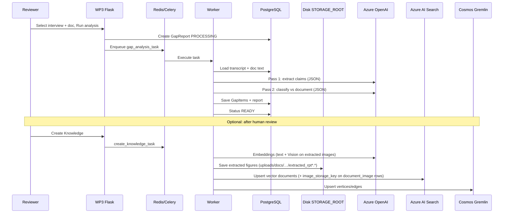
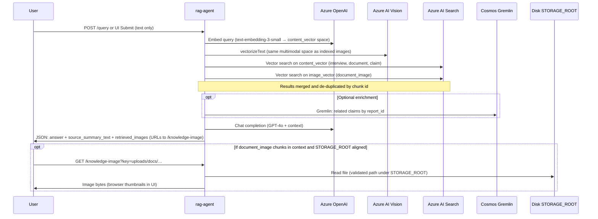

# High-Level Design (HLD) — Complete System

**Tacit knowledge capture, documentation alignment, and LLM-assisted query**

**Repositories:** `WP3` (back-office) · `rag-agent` (retrieval UI/API) · **Microsoft Azure** (managed AI and knowledge services)

**Document purpose:** (1) Describe the **end-to-end system** and how components communicate. (2) Ground the **research framework** (tacit vs explicit knowledge). (3) Record the **evolution from a HuggingFace baseline to Azure OpenAI NLI**, so outcomes can be traced to **approach vs implementation** vs **model/prompt limits**.

---

## 1. Research framework (what we built)

### 1.1 Problem framing

**Tacit knowledge** in expert interviews is often **contextual** and **verbal**; **explicit knowledge** lives in manuals, specs, and guides. Misalignment between what experts *say* and what is *written* creates risk for operations, training, and compliance.

### 1.2 Conceptual pipeline

We operationalise “gap analysis” as:

1. **Collect** tacit-like signals from **two structured sources**: (A) **interview** (speech → text → English), (B) **supporting documentation** (extracted text, translated if needed).
2. **Align** them through **Natural Language Inference (NLI)**: each **claim** from the interview is judged against the document as **supported**, **contradicted**, or **unknown** relative to written evidence.
3. **Human-in-the-loop**: reviewers refine actions (e.g. “Add to documentation”) and can **promote** vetted content into a **knowledge layer**.
4. **Utilise** accumulated knowledge via an **LLM-backed query agent** (**Tacit-Expert** / `rag-agent`): retrieval (**text vectors + image vectors** on the same index, optional **graph** enrichment) + grounded answer generation. The user query stays **text-only**; image chunks are retrieved via **Azure AI Vision** `vectorizeText` in the same embedding space as indexed figures.

This is **not** a single monolithic “agent” in the Copilot sense, but a **framework** of services: deterministic ingestion, LLM for NLI and RAG, and optional graph/search for scalable retrieval.

### 1.3 Two data sources (inputs to NLI)

| Source | Role | Typical form |
|--------|------|----------------|
| **Interview** | Tacit / experiential assertions, procedures as spoken | Audio → transcript (FI) → segments + English text |
| **Supporting document** | Authoritative explicit knowledge | PDF/DOCX/HTML/TXT → English text in DB |

NLI compares **claims** derived from (1) against **evidence** from (2).

---

## 2. Complete system — logical view

The **complete system** comprises:

| Layer | Components |
|-------|------------|
| **Presentation & orchestration** | WP3 Flask UI, Celery workers, PostgreSQL, Redis, local file storage |
| **Cloud AI (ingestion & reasoning)** | Azure AI Speech, Azure Translator, Azure OpenAI (chat, embeddings) |
| **Cloud knowledge** | Azure AI Search (vectors), Cosmos DB Gremlin (graph), optional Azure AI Vision (image vectors) |
| **Query surface** | `rag-agent` (FastAPI + Tacit-Expert UI), same Azure endpoints as above for read path |

---

## 3. How components communicate (figures)

### 3.1 Deployment & data flow (overview)

*Render with Mermaid (GitHub, VS Code, or [mermaid.live](https://mermaid.live)).*

```mermaid
flowchart LR
  subgraph host [Developer / org network]
    U1[Reviewer]
    U2[Query user]
  end

  subgraph wp3 [WP3 container(s)]
    WEB[Flask web :5000]
    WK[Celery worker]
    PG[(PostgreSQL)]
    RD[(Redis)]
    FS[File storage]
  end

  subgraph ragc [rag-agent container(s)]
    API[FastAPI :8000]
  end

  subgraph az [Microsoft Azure - HTTPS APIs]
    SP[Azure AI Speech]
    TR[Azure Translator]
    OAI[Azure OpenAI]
    SRCH[Azure AI Search]
    GR[Cosmos DB Gremlin]
    CV[Azure AI Vision]
  end

  U1 --> WEB
  U2 --> API

  WEB --> PG
  WEB --> RD
  WEB --> FS
  RD --> WK
  WK --> PG
  WK --> FS

  WK --> SP
  WK --> TR
  WK --> OAI
  WK --> SRCH
  WK --> GR
  WK --> CV

  API --> OAI
  API --> SRCH
  API --> GR
  API -. optional .-> CV
  API -. read-only .-> FS
```

**Legend**

- **WP3 → Azure:** Outbound **HTTPS** from the worker to Azure APIs (keys via environment variables).
- **rag-agent → Azure:** Same pattern; **no direct WP3 ↔ rag-agent** HTTP call in the prototype — both use Azure as the shared knowledge plane; WP3 **writes** index/graph; rag-agent **reads**. For **image-vector** retrieval, rag-agent calls **Azure AI Vision** (`vectorizeText`) when `AZURE_VISION_*` is set (same keys/endpoint as Create Knowledge).
- **Figures on disk:** On **Create Knowledge**, the WP3 worker **saves** extracted PDF/DOCX images under `STORAGE_ROOT` (e.g. `uploads/docs/{doc_id}/extracted_rpt{report_id}_*.{ext}`) and stores the relative path in the search index as **`image_storage_key`**. **rag-agent** mounts or points `STORAGE_ROOT` at the **same** tree and serves bytes with **`GET /knowledge-image?key=...`** (PoC file share, not a WP3 HTTP API).
- **WP3 internal:** Browser → Flask; Flask → Redis → Celery; workers read/write **PostgreSQL** and **disk storage**.

### 3.2 Sequence — gap analysis and knowledge creation (simplified)



### 3.3 Sequence — Tacit-Expert query (`rag-agent`)



If Vision is **not** configured on rag-agent, the **image_vector** leg is skipped (empty vector); **text retrieval** still runs. **`retrieved_images`** is empty if chunks lack **`image_storage_key`** (re-run Create Knowledge after that field exists) or if **`STORAGE_ROOT`** on rag-agent does not contain the files.

---

## 4. End-to-end data flow (tabular)

| Step | Where | What |
|------|--------|------|
| 1 | WP3 | Upload interview audio + metadata; upload supporting document. |
| 2 | WP3 | Persist rows + files; enqueue Celery ingest tasks. |
| 3 | Worker + Azure | Speech: transcribe + diarize; Translator: FI→EN; optional OpenAI: speaker names. |
| 4 | Worker + Azure | Document: extract text; translate if Finnish. |
| 5 | WP3 | Status **READY**; data in PostgreSQL + storage. |
| 6 | Worker + Azure OpenAI | **NLI pipeline:** extract claims → classify each vs full document text. |
| 7 | WP3 | Gap report in DB + Excel; UI + review workflow. |
| 8 | Worker + Azure + disk | **Create Knowledge:** text/image embeddings → AI Search (**includes `image_storage_key`**); **extracted figures saved** next to WP3 uploads; graph → Gremlin. |
| 9 | rag-agent + Azure (+ shared storage) | User question → **text + image-vector** retrieve → optional graph claims → LLM answer; **`retrieved_images`** + **`GET /knowledge-image`** when `STORAGE_ROOT` matches WP3. |

---

## 5. Input data (prototype)

| Input | Notes |
|-------|--------|
| Interviews | Finnish dialogue typical; length ~15–45+ min in tests; count study-specific (e.g. single digits to tens). |
| Documents | PDF, DOCX, HTML, TXT; FI or EN; one or few manuals per run in PoC. |
| Outputs | JSON in DB; Excel 3-sheet report; PDFs generated where applicable. |

### 5.1 Knowledge indexing and chunking (Create Knowledge)

Implementation reference: `WP3/tasks/knowledge.py`.

| Content | Chunking rule (PoC) | Vector field |
|--------|----------------------|--------------|
| **Interview transcript** | Group **speaker segments** (timestamp + speaker + text), growing batches until roughly **~500 tokens** (word-count proxy), then start a new chunk. | `content_vector` (text embedding) |
| **Supporting document** | Split on **blank-line paragraphs**, merge paragraphs until ~**500 tokens**, then new chunk. | `content_vector` |
| **Gap claims** | **One chunk per claim** (claim text). | `content_vector` |
| **Figures in PDF/DOCX** | **One chunk per extracted image**. PDF layout: **text blocks above the figure** (manual headings) plus **page number** are prepended to indexed **`content`** (with Vision caption/OCR). **Create Knowledge** **deletes** prior Search rows for that **`report_id`** then upserts (no stale ids). Rag-agent **caps** low-scoring figures per query. | `content_vector` + `image_vector` + `image_storage_key` |

**PoC caveat:** These boundaries are **deliberately simple** so play data can be indexed quickly. In **production**, you would typically define **richer structure-aware chunking** (e.g. headings, page/section metadata, tables, minimum/maximum token bounds, deduplication, language tags, security labels) and **stronger provenance** fields for audit and UI display.

---

## 6. Azure services — role and alternatives

(Summary; see also prior governance discussions on **Knowledge Store vs Gremlin**.)

| Service | Role | Rationale |
|---------|------|-----------|
| Azure AI Speech | ASR + diarization | Managed, long audio; vs self-hosted Whisper ops. |
| Azure Translator | FI→EN at scale | Cost/latency vs LLM-only translation. |
| Azure OpenAI | NLI (GPT-4o), embeddings, RAG answers, aux. tasks | Nuanced entailment + JSON; vs small HF models (see §7). |
| Azure AI Search | Vector index for RAG | ANN search; vs Knowledge Store as **projection store** not primary vector engine. |
| Cosmos DB Gremlin | Graph of interview/doc/claim/chunk | Multi-hop, evolving relations, context-graph direction; vs flat tables only. |
| Azure AI Vision | Optional image vectors | Multimodal retrieval. |

**Non-Azure:** PostgreSQL, Redis, local disk (PoC); production may use Blob + managed DB.

---

## 7. Evolution: HuggingFace baseline → Azure OpenAI NLI

### 7.1 Snapshot A — earlier prototype (conceptual)

Before Azure integration, the pipeline used **self-hosted HuggingFace** components and a **lightweight, non-LLM NLI-style step**:

| Stage | Technology (legacy) | Idea |
|-------|----------------------|------|
| Speech | **faster-whisper** (or similar) local ASR | Offline transcription |
| Translation | **Helsinki-NLP** OPUS-MT style models (`transformers`) | FI→EN sentence-level |
| Gap / “NLI” | **Heuristic + encoder similarity** | e.g. split transcript into candidate sentences; embed claim and doc windows with a **sentence-transformer** or similar; **cosine similarity** + thresholds to guess align/contradict; optional keyword overlap |

**Pseudocode (illustrative — not current code):**

```
for each sentence S in translated_transcript:
    if not looks_like_claim(S): continue
    best_window = argmax_window_similarity(embed(S), embed(doc_paragraphs))
    if similarity > T_high: label = SUPPORTED
    elif similarity < T_low: label = UNKNOWN
    else: label = CONTRADICTED or UNKNOWN  # brittle
```

**Why this failed for research-quality gaps**

- **Entailment is not similarity.** Paraphrase and translation shift embedding space; **high similarity ≠ support**, **low similarity ≠ contradiction**.
- **No structured reasoning** over document structure; long manuals need **targeted evidence**, not one global score.
- **Threshold tuning** was unstable across interviews and doc types.
- **Claim segmentation** was naive; important assertions were missed or merged.
- **Contradictions** were often **false positives** (wording/detail differences) or **false negatives** (subtle conflicts).

These limitations **confounded** the research question: poor output could be “the hypothesis is wrong” or “the detector is wrong.” Moving to an **explicit LLM NLI** with **auditable prompts** separates **model behaviour** from **wiring**.

### 7.2 Snapshot B — current approach (Azure OpenAI)

- **Model:** **GPT-4o** (deployment configurable via `AZURE_OPENAI_NLI_DEPLOYMENT`).
- **Architecture:** **Two-pass** pipeline:
  - **Pass 1 — Extraction:** senior technical documentation expert persona; **maximally inclusive** claims; transcript **chunked** (~30 lines) so the full interview is covered.
  - **Pass 2 — Classification:** **precise technical auditor** persona; **chain-of-thought** (search → reason → label); strict rules: **factual meaning** over wording; **translation tolerance**; **softened false contradictions**.

**Prompt evolution (narrative for thesis)**

1. Early **single-pass** JSON with a smaller model produced **truncated JSON**, **too many SUPPORTED**, and **too few claims**.
2. **TPM / rate limits** addressed with retries, batching, and deployment sizing.
3. **Extraction prompt** broadened with examples and explicit “40–80+ claims” expectation; **chunked extraction** added so long transcripts were not under-sampled.
4. **Classification prompt** rewritten to reduce **false CONTRADICTED** (SIM-card style cases): require **genuine factual conflict**, not paraphrase or translation noise.
5. **Speaker naming** improved with deterministic greeting parsing + stronger LLM fallback.

### 7.3 Snapshot C — current system prompts (production copy)

*Source of truth: `WP3/tasks/azure_agent.py` — copied here for documentation. If code drifts, prefer the repository file.*

#### Pass 1 — `EXTRACT_SYSTEM_PROMPT`

```
You are a senior technical documentation expert. Your ONLY job right now is to \
extract claims from an interview transcript. Do NOT classify or judge them.

You will receive an INTERVIEW TRANSCRIPT (English) with timestamps and speakers.

TASK: Read every sentence. Sort each sentence into one of two buckets:

1. CLAIMS – ANY statement that describes, asserts, or implies something \
about a product, system, feature, component, process, procedure, specification, \
location, layout, dimension, material, technology, configuration, capability, \
limitation, compatibility, instruction, or step. This includes:
  - Descriptions of physical features ("There are two cameras on the back")
  - Location/layout statements ("The USB-C port is at the bottom")
  - How-to instructions ("You insert the SIM card from the right side")
  - Capability statements ("It supports dual SIM")
  - Compatibility/limitation ("You cannot use SD card with dual SIM")
  - Comparisons ("There are two variants of the phone")
  - Any statement that could be TRUE or FALSE when checked against documentation

CRITICAL: Be MAXIMALLY inclusive. If a sentence contains ANY factual content \
about the product or system, it is a CLAIM. You should extract 40-80+ claims \
from a typical 20-30 minute technical interview. If you extract fewer than 30, \
you are being too conservative.

2. OUT OF SCOPE – ONLY these narrow categories:
  - Pure greetings ("Hello", "Hi Kari", "Nice to meet you")
  - Pure filler with zero factual content ("okay", "right", "oh well", "good good")
  - Procedural meta-talk with no product info ("let's move on", "shall we go through")
  - Questions that contain no assertions (but if a question implies a fact, \
    extract the implied fact as a claim)

Return a JSON object with exactly this structure:
{
  "claims": [
    {
      "claim": "The factual statement, rephrased clearly if needed.",
      "interview_evidence": "HH:MM – Speaker: exact quote from transcript",
      "original_index": 1
    }
  ],
  "out_of_scope": [
    {
      "sentence": "The excluded sentence.",
      "reason": "greeting | filler | question | procedural"
    }
  ]
}

Be thorough. Process EVERY sentence. Number claims starting from 1. \
Err heavily on the side of including something as a claim.
```

#### Pass 2 — `CLASSIFY_SYSTEM_PROMPT`

```
You are a precise technical auditor comparing interview claims against \
supporting documentation. Your goal is ACCURACY — correctly identifying \
what is supported, what is contradicted, and what is not covered.

You will receive:
1. A batch of CLAIMS extracted from an interview transcript.
2. A SUPPORTING DOCUMENT (English text).

IMPORTANT: The interview transcript was machine-translated from Finnish. \
Minor wording differences between the interview and document are expected \
due to translation artifacts. Focus on FACTUAL MEANING, not exact wording.

For EACH claim, follow this reasoning process:

STEP 1 – SEARCH: Find the most relevant passage in the document. Quote it \
exactly (up to 2 sentences). If nothing is relevant, state "No relevant \
passage found."

STEP 2 – REASON: Compare the FACTUAL MEANING of the claim against the \
quoted passage:
  a) Do they convey the same factual information, even if worded differently?
  b) Do they make genuinely OPPOSITE or INCOMPATIBLE factual statements?
  c) Is the topic simply not addressed in the document?

STEP 3 – LABEL: Assign exactly one label:

  SUPPORTED: The document confirms the same factual information as the claim. \
  The claim and document agree on the key facts, even if they use different \
  wording, different levels of detail, or slightly different phrasing. \
  A simplified version of a documented fact is still SUPPORTED. \
  A more detailed version of a documented fact is still SUPPORTED.

  CONTRADICTED: The document makes a GENUINELY OPPOSITE or INCOMPATIBLE \
  factual statement. Examples of real contradictions:
    - Claim says "X uses version 3" but document says "X uses version 5"
    - Claim says "backups run daily" but document says "backups run weekly"
    - Claim says "the system supports feature X" but document says "feature X \
      is not supported"
  NOT a contradiction: same fact stated with different wording or detail level.

  UNKNOWN: The document does not address this topic at all, or only mentions \
  it too vaguely to confirm or deny.

CRITICAL RULES:
  - Different wording ≠ contradiction. Focus on whether the FACTS agree.
  - A simplified claim that captures the essence of a documented fact = SUPPORTED.
  - The interview is translated — expect imprecise language. Be generous with \
    wording differences, strict with factual differences.
  - When in doubt between SUPPORTED and CONTRADICTED → check: do the core \
    facts actually conflict? If not, it is SUPPORTED.
  - When in doubt between SUPPORTED and UNKNOWN → choose UNKNOWN.
  - Subjective claims ("easy", "fast") without documentary evidence = UNKNOWN.

Return a JSON object:
{
  "results": [
    {
      "original_index": 1,
      "claim": "The claim text.",
      "label": "SUPPORTED",
      "doc_evidence": "Exact quote from document, or 'No relevant passage found.'",
      "reasoning": "Step-by-step explanation of why this label was chosen.",
      "confidence": "High | Medium | Low",
      "action_suggestion": "A concrete recommendation."
    }
  ]
}

Confidence guidelines:
- High: Clear factual match or clear factual conflict.
- Medium: Partial evidence, some interpretation needed.
- Low: Weak or indirect evidence.

Action suggestions:
- SUPPORTED → "Confirm in next review" or "Already documented"
- CONTRADICTED → "Review contradiction: document says X but interview says Y"
- UNKNOWN → "Investigate further" or "Add to documentation backlog"
```

---

## 8. Successful prototype outputs

- Gap table + Excel with **claim, label, interview evidence, doc evidence, confidence, actions**.
- **Reviewed** workflow and optional **Create Knowledge** → search + graph.
- **Tacit-Expert:** natural language answer + **human-readable source breakdown** (counts by type)—**not** internal Azure Search document ids in the UI; **retrieved document figures** rendered as thumbnails when **`document_image`** chunks are in context and files are available under **`STORAGE_ROOT`**.

---

## 9. Confidential data

Interview audio, transcripts, and internal documents: **confidential** unless public. TLS to Azure; secrets in env/Key Vault; minimal logging of content; retention per ethics/DPA. WP3 authenticated users; restrict `rag-agent` by network/auth in deployment.

---

## 10. Exit criteria (approach vs implementation)

| Question | If “no”, likely cause |
|----------|------------------------|
| Does E2E run on pilot data without hidden integration errors? | Implementation |
| Are labels auditable (evidence fields filled)? | Implementation or prompt |
| Do known contradictions in pilot material surface as CONTRADICTED? | Approach / model / prompt |
| Does RAG answer from retrieved context without obvious fabrication? | Retrieval + generation |

**Architecture “complete”** when this document + logs allow tracing failures to **step and service**.

---

## 11. Repository map

| Repo | Responsibility |
|------|------------------|
| **WP3** | Ingestion, gap analysis, review, Excel, Create Knowledge writers |
| **rag-agent** | Read-only RAG + Tacit-Expert UI |

### 11.1 `rag-agent` technology stack

| Layer | Technology |
|-------|------------|
| **API & UI** | **FastAPI**, **Uvicorn**, embedded **HTML/JS** chat page (`/`) |
| **Config** | **python-dotenv** (`config.py` / `.env`) |
| **Retrieval** | **azure-search-documents** (`SearchClient`, `VectorizedQuery` on `content_vector` and `image_vector`) |
| **Query embeddings** | **openai** SDK → **Azure OpenAI** (`text-embedding-3-small` or configured deployment) |
| **Image query embedding** | **requests** → **Azure AI Vision** `retrieval:vectorizeText` (aligned with WP3 `embed_image` / `image_vector`) |
| **Figure files (PoC)** | **`STORAGE_ROOT`** (env) aligned with WP3 disk layout; **`GET /knowledge-image`** serves `uploads/docs/…/extracted_rpt*.*` with path validation |
| **Graph (optional)** | **gremlinpython** → Cosmos DB Gremlin |
| **Orchestration (optional)** | **temporalio** worker + `RAGQueryWorkflow`; if `USE_TEMPORAL=false`, pipeline runs **in-process** (`asyncio.to_thread`) |
| **Deployment** | **Docker** (typical: single container exposing port 8000) |

---

## Document control

| Version | Notes |
|---------|--------|
| 0.4 | Figure persistence (`image_storage_key`, disk paths), rag-agent `/knowledge-image` + shared `STORAGE_ROOT`, HLD diagrams/legend and §11.1 updated |
| 0.3 | RAG: multimodal retrieval (text + image vectors), source summary UX, §5.1 chunking + PoC caveat, rag-agent tech stack (§11.1) |
| 0.2 | Complete system HLD: WP3 + Azure + rag-agent, communication figures, framework, HF→LLM evolution, prompt snapshots |
| 0.1 | Initial WP3-centric draft |

---

*For export: render Mermaid diagrams to PNG/PDF via IDE plugins or mermaid.live and insert into thesis appendices.*
