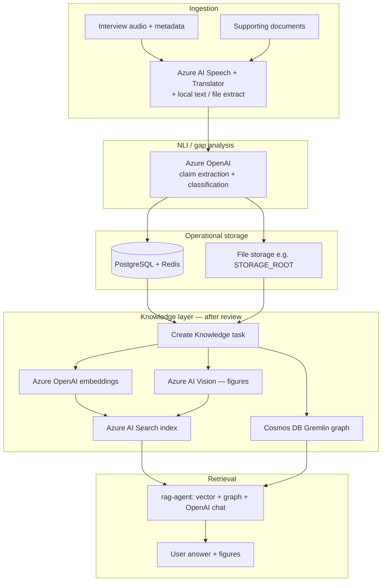
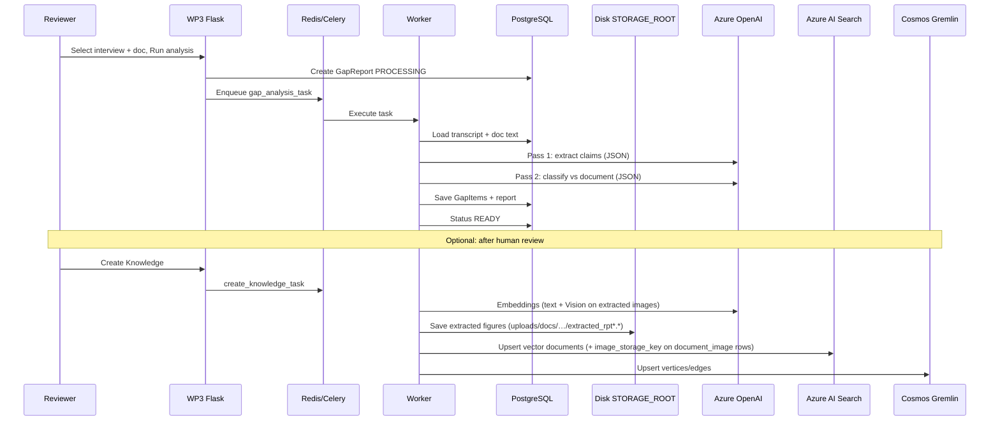
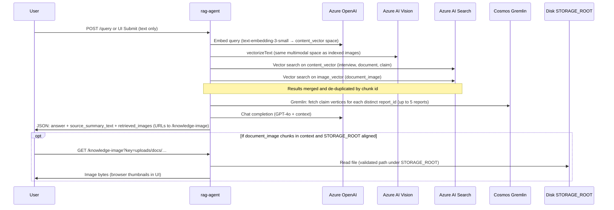

# WP3 - Research Notes, Research Findings and Architectural Choices Explanation

**Tacit knowledge capture, documentation alignment, and LLM-assisted query**

**Repositories:** `WP3` (back-office) · `rag-agent` (retrieval UI/API) · **Microsoft Azure** (managed AI and knowledge services)

**Document purpose:** (1) Describe the **end-to-end system** and how components communicate. (2) Ground the **research framework** (tacit vs explicit knowledge). (3) Record the **evolution from a HuggingFace baseline to Azure OpenAI NLI**, so outcomes can be traced to **approach vs implementation** vs **model/prompt limits**. (4) State the **methodological workflow** (capture → structuring → retrieval) in **§1.4**, distinct from the **technical pipeline** from **§2** onward. (5) Explain the **methodological basis for tacit capture**—**SECI** and the **NLI extension**—in **§1.5** (prose only; aligned with the project’s methodology framing, not slide reproductions).

---

## 1. Research framework (what we built)

### 1.1 Problem framing

**Tacit knowledge** in expert interviews is often **contextual** and **verbal**; **explicit knowledge** lives in manuals, specs, and guides. Misalignment between what experts *say* and what is *written* creates risk for operations, training, and compliance.

### 1.2 Conceptual pipeline

We operationalise “gap analysis” as:

1. **Collect** tacit-like signals from **two structured sources**: (A) **interview** (speech → text → English), (B) **supporting documentation** (extracted text, translated if needed).
2. **Align** them through **Natural Language Inference (NLI)**: each **claim** from the interview is judged against the document as **supported**, **contradicted**, or **unknown** relative to written evidence.
3. **Human-in-the-loop**: reviewers refine actions (e.g. “Add to documentation”) and can **promote** vetted content into a **knowledge layer**.
4. **Utilise** accumulated knowledge via an **LLM-backed query agent** (**Tacit-Expert** / `rag-agent`): **vector retrieval** (text + image fields on the same index) → **Gremlin graph lookup** (related **claim** vertices per `report_id` from those hits) → **grounded LLM** answer. The user query stays **text-only**; image chunks are retrieved via **Azure AI Vision** `vectorizeText` in the same embedding space as indexed figures.

This is **not** a single monolithic “agent” in the Copilot sense, but a **framework** of services: deterministic ingestion, LLM for NLI and RAG, and Azure Search + Gremlin for retrieval and context expansion.

### 1.3 Two data sources (inputs to NLI)


| Source                  | Role                                                  | Typical form                                      |
| ----------------------- | ----------------------------------------------------- | ------------------------------------------------- |
| **Interview**           | Tacit / experiential assertions, procedures as spoken | Audio → transcript (FI) → segments + English text |
| **Supporting document** | Authoritative explicit knowledge                      | PDF/DOCX/HTML/TXT → English text in DB            |


NLI compares **claims** derived from (1) against **evidence** from (2).

### 1.4 Methodological workflow (capture → structuring → retrieval)

The subsections above (especially **§1.2**) already sketch *what* the system does. Here the same journey is described as a **research method**—the stages a study would recognise—without naming specific products or services. **§2 and below** map these stages onto **software, data stores, and cloud APIs**.

1. **Capture**
  **Goal:** Preserve **tacit-like** material and **authoritative** written material in a form suitable for later analysis. Operationally that means: spoken expert accounts (audio, with context such as who is speaking and when) and one or more **supporting documents** that represent the official or intended description of procedures, products, or policies. Capture is **faithful recording and normalisation** (e.g. a single working language for comparison) rather than interpretation of gaps.
2. **Structuring and alignment**
  **Goal:** Turn **continuous** interview text into **discrete, checkable units** and relate each unit to the document corpus. Each unit is treated as a **claim** about how things work or what ought to be done; the method then asks, for each claim, whether the documentation **supports** it, **contradicts** it, or leaves the relationship **unknown**, with **traceable evidence** from the text. This step is the core **methodological** move: it makes tacit assertions **comparable** to explicit knowledge in a structured way (labels, suggested actions, exports for review).
3. **Curation and promotion**
  **Goal:** Insert **human judgment** between automatic alignment and any reuse as “organisational knowledge.” Reviewers inspect machine outputs, adjust recommended actions, and decide when material is **ready** to be treated as vetted input for a **knowledge layer** intended for search and query—not as a replacement for governance or domain sign-off in a real deployment.
4. **Retrieval and utilisation**
  **Goal:** Allow **stakeholders** (researchers, reviewers, or end users in a demo setting) to **ask questions in natural language** and receive **answers grounded** in the same interview segments, document passages, gap-claim artefacts, and (where indexed) figures that were captured and curated. Methodologically this is **reuse of structured capture**: retrieval is not a separate study but the **downstream use** of the corpus produced by (1)–(3). The PoC implements this as **similarity-based retrieval plus LLM synthesis** over retrieved context; **§1.2** step 4 and **§2+** spell out how that is realised technically.

**Relation to §1.2:** **§1.2** is the **compact operationalisation** of this workflow (collect → align → human-in-the-loop → utilise). **§1.4** makes the **methodological intent** explicit for readers who care about **process** before **architecture**.

### 1.5 Methodological basis for tacit capture (SECI and NLI extension)

**§1.1–§1.4** describe what the system does and how stages line up with research practice. This subsection records the **knowledge-management framing** distilled from the project’s methodology narrative (e.g. SECI-based tacit capture and NLI as an auditable gap layer): **why** interviews, **why** documentation is the evidence base, and **how** that differs from describing only the software stack. **§7** remains the place for **how the NLI implementation evolved** (HuggingFace baseline → Azure OpenAI).

#### SECI as reference model

We ground the study in the **SECI model** (Nonaka & Takeuchi): **Socialization**, **Externalization**, **Combination**, and **Internalization**—the standard account of how **tacit** and **explicit** knowledge convert into one another in organisational learning.

#### How this project maps onto that framing

- **Interviews** are the main instrument for **externalization**: experts articulate know-how in **speech**, which we preserve as **recorded audio** and, after capture, as **transcripts** and **English-aligned text** suitable for analysis.
- **Supporting documents** (manuals, guides, specs) are treated as the **explicit knowledge base**—the written record against which spoken expertise is evaluated.
- **Methodological reliability** is pursued through **cross-referencing**: the interview is not analysed in isolation; **claims** inferred from dialogue are checked **against** that documentation so alignment or tension is **evidence-backed**, not impressionistic.

The intended outcome of this interaction is **structured artefacts** (discrete claims, classification outcomes, citations to document text, reviewer-facing gap reports)—not merely raw recordings. The aim is to keep the study **methodologically sound**, not only **technically interesting**: externalised speech is **cross-referenced** to an explicit corpus so downstream steps are **traceable** and open to review.

#### Extending SECI with an NLI-oriented gap-analysis layer

SECI explains **how tacit can become explicit**; it does not by itself **audit** whether what experts **say** **matches**, **conflicts with**, or **falls outside** what is **already written**. We therefore describe the approach as **extending SECI with an NLI-based gap analysis**:

1. **Input:** interview **transcripts** (after capture and language normalisation where needed).
2. **Transformation:** transcripts are turned into **structured claims**—short, testable propositions attributable to the interview content.
3. **Validation:** supporting documents supply the **evidence base** used to judge each claim.
4. **Classification (NLI layer):** each claim is classified, with reference to textual evidence, as **supported**, **contradicted**, or **unknown** relative to the documentation.
5. **Output:** a **gap report** that aggregates these judgements for human review (and, in the PoC, structured stores and exports such as Excel).

#### Review: from gap report to documentation decisions

The gap report is a **decision artefact**, not a terminal output. Reviewers use it to decide, **methodologically**, what to do next—for example: material that can be **discarded** or deprioritised; themes that **warrant further investigation**; and content that **should be added or corrected** in formal documentation so explicit knowledge stays accountable to expert practice.


**Relation to §1.4:** **§1.4** states the **generic** workflow (capture → structuring → retrieval). **§1.5** ties **capture and structuring** to **SECI** and states the **NLI-on-documentation** extension and **review logic** that motivate the pipeline. **§2+** show the **technical realisation**.

---

## 2. Complete system — logical view

The **complete system** comprises:


| Layer                                | Components                                                                                     |
| ------------------------------------ | ---------------------------------------------------------------------------------------------- |
| **Presentation & orchestration**     | WP3 Flask UI, Celery workers, PostgreSQL, Redis, local file storage                            |
| **Cloud AI (ingestion & reasoning)** | Azure AI Speech, Azure Translator, Azure OpenAI (chat, embeddings)                             |
| **Cloud knowledge**                  | Azure AI Search (vectors), Cosmos DB Gremlin (graph), optional Azure AI Vision (image vectors) |
| **Query surface**                    | `rag-agent` (FastAPI + Tacit-Expert UI), same Azure endpoints as above for read path           |


### 2.1 Canonical pipeline — ingestion → NLI → storage → retrieval

The following diagram is the **architecture-level** spine of the system (logical phases, not every micro-step). **Create Knowledge** (after human review) projects operational data from PostgreSQL and files into the **knowledge plane** (Search + Gremlin) used by **rag-agent**.

*Render with Mermaid (GitHub, VS Code, or [mermaid.live](https://mermaid.live)).*




**Reading the diagram:** **Ingestion** produces **English-aligned text** suitable for analysis. **NLI** writes **structured gap results** to **operational storage**. **Create Knowledge** (optional in the product sense of “user action”, but required for Tacit-Expert) **materialises** vectors and graph edges into Azure. **Retrieval** reads Search + Gremlin and does **not** write back to WP3 in the PoC.

---

## 3. How components communicate (figures)

### 3.1 Deployment & data flow (overview)

*Render with Mermaid (GitHub, VS Code, or [mermaid.live](https://mermaid.live)).*

```mermaid
flowchart LR
  subgraph host [Developer / org network]
    U1[Reviewer]
    U2[Query user]
  end

  subgraph wp3 [WP3 container(s)]
    WEB[Flask web :5000]
    WK[Celery worker]
    PG[(PostgreSQL)]
    RD[(Redis)]
    FS[File storage]
  end

  subgraph ragc [rag-agent container(s)]
    API[FastAPI :8000]
  end

  subgraph az [Microsoft Azure - HTTPS APIs]
    SP[Azure AI Speech]
    TR[Azure Translator]
    OAI[Azure OpenAI]
    SRCH[Azure AI Search]
    GR[Cosmos DB Gremlin]
    CV[Azure AI Vision]
  end

  U1 --> WEB
  U2 --> API

  WEB --> PG
  WEB --> RD
  WEB --> FS
  RD --> WK
  WK --> PG
  WK --> FS

  WK --> SP
  WK --> TR
  WK --> OAI
  WK --> SRCH
  WK --> GR
  WK --> CV

  API --> OAI
  API --> SRCH
  API --> GR
  API -. optional .-> CV
  API -. read-only .-> FS
```


**Legend**

- **WP3 → Azure:** Outbound **HTTPS** from the worker to Azure APIs (keys via environment variables).
- **rag-agent → Azure:** Same pattern; **no direct WP3 ↔ rag-agent** HTTP call in the prototype — both use Azure as the shared knowledge plane; WP3 **writes** index/graph; rag-agent **reads**. For **image-vector** retrieval, rag-agent calls **Azure AI Vision** (`vectorizeText`) when `AZURE_VISION_*` is set (same keys/endpoint as Create Knowledge).
- **Figures on disk:** On **Create Knowledge**, the WP3 worker **saves** extracted PDF/DOCX images under `STORAGE_ROOT` (e.g. `uploads/docs/{doc_id}/extracted_rpt{report_id}_*.{ext}`) and stores the relative path in the search index as `**image_storage_key`**. rag-agent mounts or points `STORAGE_ROOT` at the same tree and serves bytes with `**GET /knowledge-image?key=...`** (PoC file share, not a WP3 HTTP API).
- **WP3 internal:** Browser → Flask; Flask → Redis → Celery; workers read/write **PostgreSQL** and **disk storage**.

### 3.2 Sequence — gap analysis and knowledge creation (simplified)




### 3.3 Sequence — Tacit-Expert query (`rag-agent`)




If Vision is **not** configured on rag-agent, the **image_vector** leg is skipped (empty vector); **text retrieval** still runs. `**retrieved_images`** is empty if chunks lack `**image_storage_key`** (re-run Create Knowledge after that field exists) or if `**STORAGE_ROOT**` on rag-agent does not contain the files.

**Graph vs Temporal:** **Temporal** is optional and controlled by `**USE_TEMPORAL`**. Graph traversal is not—`rag-agent` always calls Gremlin after vector search when there are hits with `**report_id`**, merging related **claims** into the LLM context (`get_related_claims_for_report`). If **Gremlin is not configured**, credentials are wrong, or the query errors, that step simply adds **no** extra claims (degraded behaviour), unlike Temporal which is an alternate execution path. For **multi-hop** vs **current** Gremlin usage, see **§6.5.1**.

---

## 4. End-to-end data flow (tabular)


| Step | Where                                | What                                                                                                                                                                                              |
| ---- | ------------------------------------ | ------------------------------------------------------------------------------------------------------------------------------------------------------------------------------------------------- |
| 1    | WP3                                  | Upload interview audio + metadata; upload supporting document.                                                                                                                                    |
| 2    | WP3                                  | Persist rows + files; enqueue Celery ingest tasks.                                                                                                                                                |
| 3    | Worker + Azure                       | Speech: transcribe + diarize; Translator: FI→EN; optional OpenAI: speaker names.                                                                                                                  |
| 4    | Worker + Azure                       | Document: extract text; translate if Finnish.                                                                                                                                                     |
| 5    | WP3                                  | Status **READY**; data in PostgreSQL + storage.                                                                                                                                                   |
| 6    | Worker + Azure OpenAI                | **NLI pipeline:** extract claims → classify each vs full document text.                                                                                                                           |
| 7    | WP3                                  | Gap report in DB + Excel; UI + review workflow.                                                                                                                                                   |
| 8    | Worker + Azure + disk                | **Create Knowledge:** text/image embeddings → AI Search (**includes `image_storage_key`**); **extracted figures saved** next to WP3 uploads; graph → Gremlin.                                     |
| 9    | rag-agent + Azure (+ shared storage) | User question → **text + image-vector** retrieve → **Gremlin claim expansion** per `report_id` → LLM answer; `**retrieved_images`** + `**GET /knowledge-image`** when `STORAGE_ROOT` matches WP3. |


---

## 5. Input data (prototype)


| Input      | Notes                                                                                                     |
| ---------- | --------------------------------------------------------------------------------------------------------- |
| Interviews | Finnish dialogue typical; length ~15–45+ min in tests; count study-specific (e.g. single digits to tens). |
| Documents  | PDF, DOCX, HTML, TXT; FI or EN; one or few manuals per run in PoC.                                        |
| Outputs    | JSON in DB; Excel 3-sheet report; PDFs generated where applicable.                                        |


### 5.1 Knowledge indexing and chunking (Create Knowledge)

Implementation reference: `WP3/tasks/knowledge.py`.


| Content                  | Chunking rule (PoC)                                                                                                                                                                                                                                                                                                                                 | Vector field                                            |
| ------------------------ | --------------------------------------------------------------------------------------------------------------------------------------------------------------------------------------------------------------------------------------------------------------------------------------------------------------------------------------------------- | ------------------------------------------------------- |
| **Interview transcript** | Group **speaker segments** (timestamp + speaker + text), growing batches until roughly **~500 tokens** (word-count proxy), then start a new chunk.                                                                                                                                                                                                  | `content_vector` (text embedding)                       |
| **Supporting document**  | Split on **blank-line paragraphs**, merge paragraphs until ~**500 tokens**, then new chunk.                                                                                                                                                                                                                                                         | `content_vector`                                        |
| **Gap claims**           | **One chunk per claim** (claim text).                                                                                                                                                                                                                                                                                                               | `content_vector`                                        |
| **Figures in PDF/DOCX**  | **One chunk per extracted image**. PDF layout: **text blocks above the figure** (manual headings) plus **page number** are prepended to indexed `**content`** (with Vision caption/OCR). **Create Knowledge** **deletes** prior Search rows for that `**report_id`** then upserts (no stale ids). Rag-agent **caps** low-scoring figures per query. | `content_vector` + `image_vector` + `image_storage_key` |


**PoC caveat:** These boundaries are **deliberately simple** so play data can be indexed quickly. In **production**, you would typically define **richer structure-aware chunking** (e.g. headings, page/section metadata, tables, minimum/maximum token bounds, deduplication, language tags, security labels) and **stronger provenance** fields for audit and UI display.

---

## 6. Azure services — architecture and PoC justification

This section documents **why each Azure service exists in the architecture**, following a consistent template: **role in pipeline**, **PoC need**, **rationale for selection**, **alternatives not chosen**, and **PoC scope**. A short **summary table** is kept for quick reference; subsections §6.1–§6.6 are the architecture-centric detail.

(See also prior governance discussions on **Knowledge Store vs Gremlin**.)


| Service                 | Role (one line)                                                          |
| ----------------------- | ------------------------------------------------------------------------ |
| **Azure AI Speech**     | Interview ASR + diarization                                              |
| **Azure Translator**    | FI→EN for transcripts and documents                                      |
| **Azure OpenAI**        | NLI, embeddings, RAG chat, auxiliary LLM tasks                           |
| **Azure AI Search**     | Vector + metadata index for RAG                                          |
| **Cosmos DB (Gremlin)** | Knowledge graph; RAG claim expansion                                     |
| **Azure AI Vision**     | Figure embeddings + caption/OCR for indexing; query-side `vectorizeText` |


**Non-Azure (PoC):** PostgreSQL, Redis, Celery, local or mounted **file storage** (`STORAGE_ROOT`); production may substitute Blob Storage and fully managed orchestration.

---

### 6.1 Azure AI Speech

**Role in pipeline:**  
Transcribes **interview audio** into text and performs **speaker diarization**. The resulting transcript (and segments) is the primary structured input for downstream steps: translation (if needed), optional speaker naming, and the **NLI pipeline** (claim extraction and classification against the supporting document).

**Why it is needed for the PoC:**  
The PoC analyses **interview content at scale**. Manual transcription is **not practical or reproducible** across sessions and reviewers. An **automated speech-to-text** step is required to turn raw audio into **timed, speaker-attributed text** that the rest of the pipeline can consume deterministically.

**Why this approach was chosen:**  
**Azure AI Speech** is a **managed** service with support for **long-form audio**, **diarization**, and straightforward **HTTPS integration** from the Celery worker. It fits the same **Azure / enterprise** boundary as Translator, OpenAI, and Search, which simplifies **keys, regions, and compliance** storytelling for the PoC.

**Why alternatives were not selected:**

- **Self-hosted ASR (e.g. Whisper and variants):** Would require **GPU or CPU capacity planning**, **model updates**, **operational monitoring**, and **diarization glue**—effort that does not advance the **research question** (tacit vs explicit alignment) for this project.
- **Manual transcription:** **Not scalable**, introduces **inter-rater inconsistency**, and breaks **repeatability** when re-running the pipeline on the same audio.

**PoC scope note:**  
Speech is on the **critical path** for the interview leg of the system (**audio → text → analysis**). It is part of the **minimal ingest architecture** for any deployment that uses real interviews rather than pre-pasted text only.

---

### 6.2 Azure Translator

**Role in pipeline:**  
Translates **Finnish** (and other supported source languages) **interview and document text** into **English** so that a **single NLI and indexing language** (English) can be assumed by prompts, embeddings, and reviewers’ Excel outputs. It runs in the **ingestion** phase alongside or after Speech-derived text.

**Why it is needed for the PoC:**  
Pilot **interviews and manuals** are often **Finnish-first**. Running NLI and RAG **directly in Finnish** would require duplicate prompt sets, embedding strategies, and evaluation; **normalising to English** keeps the **experimental surface area** manageable while remaining honest about **translation tolerance** in the classifier prompt (see §7).

**Why this approach was chosen:**  
**Azure Translator** offers **predictable cost and latency** for **batch-style** translation of long documents and transcripts, **managed SLAs**, and **simple REST** usage from workers. It avoids spending **LLM tokens** on mechanical translation of whole manuals when a dedicated MT service suffices.

**Why alternatives were not selected:**

- **LLM-only translation for all ingest text:** **Higher cost and latency** for full-document translation; harder to **reproduce** token-for-token across runs unless carefully batched and cached.
- **Self-hosted open-source MT:** **Ops overhead** (serving, updates) similar to self-hosted ASR, with **little thesis value** for this PoC.

**PoC scope note:**  
Translator is **required whenever** source content is not already English. If all inputs were English, this component could be **bypassed** in configuration, but the **architecture slot** remains for bilingual studies.

---

### 6.3 Azure OpenAI (Azure AI Foundry)

**Role in pipeline:**

- **Gap analysis (NLI):** **Two-pass** JSON pipeline—**claim extraction** from the English transcript, then **classification** of each claim against the **supporting document** (SUPPORTED / CONTRADICTED / UNKNOWN) with evidence and suggested actions (`WP3/tasks/azure_agent.py`).
- **Create Knowledge:** **Text embeddings** (e.g. `text-embedding-3-small`) for interview, document, and claim chunks written to **Azure AI Search**.
- **Auxiliary:** Optional **LLM-assisted** tasks (e.g. speaker naming heuristics) where configured.
- **Retrieval (`rag-agent`):** **Query embeddings**, **chat completion** for grounded answers over retrieved context.

**Why it is needed for the PoC:**  
The research compares **tacit interview assertions** to **explicit documentation** using **entailment-style reasoning**, not raw embedding similarity (see §7). **General-purpose LLMs** with **controlled prompts** are the chosen instrument; they also **unify** embedding and chat under **one API surface** for the knowledge layer and Tacit-Expert.

**Why this approach was chosen:**  
**Azure OpenAI** (via **Azure AI Foundry** / project endpoint) provides **GPT-4-class** models, **embedding deployments**, **enterprise routing**, and **quota management** in one place. It aligns with the **Azure-native** stack (Speech, Translator, Search, Vision) and supports **auditable prompts** as the primary research artefact.

**Why alternatives were not selected:**

- **Small HuggingFace encoder models + heuristics:** Form the **baseline described in §7**—rejected for **this** system because similarity ≠ entailment and **false contradiction** rates were too high for credible gap analysis.
- **Other cloud LLM vendors:** Could work architecturally; **not selected** here to keep **one** governance and billing plane for the PoC and to match **organisational** Azure preference.

**PoC scope note:**  
OpenAI on Azure is the **primary reasoning engine** for **NLI**, **vector semantics** (text), and **RAG answers**. Without it, the **declared pipeline** (gap reports + Create Knowledge + rag-agent) does not function as designed.

---

### 6.4 Azure AI Search

**Role in pipeline:**  
Hosts the **vector search index** (`content_vector`, `image_vector`, metadata such as `source_type`, `report_id`, `image_storage_key`). **WP3** upserts documents during **Create Knowledge**; **rag-agent** runs **vector queries** and merges results before Gremlin enrichment and LLM answering.

**Why it is needed for the PoC:**  
RAG requires a **scalable retrieval substrate** that supports **approximate nearest neighbour (ANN)** search over **many chunks** per report and across reports, with **filterable metadata** for future hardening. A dedicated **search service** separates **retrieval** from **transactional OLTP** in PostgreSQL.

**Why this approach was chosen:**  
**Azure AI Search** provides **first-class vector fields**, **HNSW-style** profiles, **managed indexing**, and **HTTPS APIs** aligned with the rest of Azure. It avoids building a **custom vector store** or overloading the **relational DB** with large embedding payloads for PoC-scale experiments.

**Why alternatives were not selected:**

- **Azure Cognitive Search “Knowledge Store” alone:** Useful as a **projection store** for indexer outputs; **not** used here as the **primary vector engine** for interactive RAG—vectors and hybrid search are owned by **AI Search** as the query-facing index.
- **PostgreSQL `pgvector` only:** Viable for small corpora; for the PoC we wanted **managed search features** (ranking, scaling story, separation of concerns) closer to a **production RAG** reference architecture.
- **Self-hosted Elasticsearch / OpenSearch:** Extra **cluster operations** without benefit to the **research hypothesis** in this timeframe.

**PoC scope note:**  
AI Search is **mandatory** for the **Tacit-Expert** path as implemented. Re-running **Create Knowledge** **replaces** index rows for a given `report_id` before upsert to avoid **stale chunk ids**.

---

### 6.5 Azure Cosmos DB — Gremlin API

**Role in pipeline:**  
Stores a **property graph** of **interviews, documents, claims, and text chunks** (vertices and edges created during **Create Knowledge**, `WP3/tasks/graph.py`). **rag-agent** issues **Gremlin** queries to pull **related claim** text by `**report_id`** after vector search, **expanding LLM context** beyond the top-k search hits alone.

**Why it is needed for the PoC:**  
Flat retrieval can miss **structured relations** (e.g. which claims belong to which interview for the same report). The graph encodes **explicit linkage** for **explainability** and **multi-hop** evolution in later work; for the current PoC it **materially feeds** the RAG context assembly step.

**Why this approach was chosen:**  
**Cosmos DB with Gremlin** offers a **managed graph** API, **partitioning** (e.g. by `report_id`), and **integration** with Azure identity and monitoring. **Gremlin** matches common **TinkerPop** patterns and the **gremlinpython** client used in WP3 and rag-agent.

**Why alternatives were not selected:**

- **Relational-only modelling:** Possible for **1:1** report structures; **less natural** for **evolving** edge types (e.g. supported_by / contradicted_by) and **future graph queries** without many join tables.
- **Amazon Neptune / other graphs:** **Another cloud** and **VPC story**; out of scope for an **Azure-first** PoC.
- **In-memory graph inside the app:** **Not durable** and **not shared** between WP3 writers and rag-agent readers.

**PoC scope note:**  
Gremlin is invoked **on every rag-agent query** that has vector hits carrying `**report_id`**; if credentials are missing or queries fail, the pipeline **degrades** to **search-only context** (no extra claims). That is **operational degradation**, not a separate “optional feature flag” (contrast **Temporal** in §3.3).

#### 6.5.1 Multi-hop vs current PoC usage (Tacit-Expert)

**Question:** *Do you have a concrete PoC scenario where **multi-hop traversal** or **graph-based querying** is **required** to produce the Tacit-Expert responses?*

**Answer:** **No**—not in the sense that answers **depend** on walking **multiple hops** through the graph. `**rag-agent`** calls `**get_related_claims_for_report`**: a **filtered** Gremlin query over **claim** vertices sharing `**report_id`** with the reports implied by vector hits (see `rag-agent` `graph.py`), i.e. **report-scoped claim retrieval**, not a pattern such as interview → … → document section → figure.

**Why keep the graph in the PoC:** **Create Knowledge** still **materialises** a **richer** vertex/edge model for **linkage** and **future** multi-hop or path-style queries; **today**, Tacit-Expert is driven primarily by **vector search + LLM**, with Gremlin **enriching context** with **related claims**.

**Forward-looking multi-hop example (not required today):** e.g. “claims **contradicted** by the manual **and** tied to procedure **X** via **document structure**”—**not** implemented as a **dependency** of the current **Tacit-Expert** answer path.

---

### 6.6 Azure AI Vision

**Role in pipeline:**

- **Create Knowledge:** `**vectorizeImage`** (multimodal embedding) for **figure chunks** stored in `**image_vector`**; Image Analysis (caption + Read/OCR) to populate searchable `**content`** and `**content_vector**` for figures alongside **layout-derived headings** from the PDF (`WP3/tasks/embeddings.py`, `knowledge.py`).
- **rag-agent (optional configuration):** `**vectorizeText`** in the **same embedding space** as indexed images for **image-vector** retrieval when the user query is text-only.

**Why it is needed for the PoC:**  
Manuals contain **screenshots and diagrams** that are **not fully captured** by text extraction alone. The PoC demonstrates **multimodal knowledge**: figures are **indexed**, **retrieved**, and **shown** (via shared file storage and `GET /knowledge-image`) in Tacit-Expert.

**Why this approach was chosen:**  
**One Vision resource** supports **both** **image embeddings** and **text-in-image analysis**, aligning **vector search** and **human-readable figure metadata** without introducing a second vendor for the same modality.

**Why alternatives were not selected:**

- **CLIP / open-source image encoders self-hosted:** **Ops and dimensionality alignment** burden; harder to guarantee **end-to-end** compatibility with **text query vectors** without extra bridging models.
- **Figures omitted entirely:** Would **simplify** the stack but **undermine** the **documentation-alignment** story for visual procedures (SIM trays, gestures, etc.).

**PoC scope note:**  
If **Vision keys are absent**, **image_vector** indexing and `**vectorizeText`** retrieval **no-op**; **text-only** RAG still works if figures have **caption/OCR-derived `content_vector`**. **rag-agent** image display additionally requires **shared `STORAGE_ROOT`** with WP3 for **file bytes**.

---

## 7. Evolution: HuggingFace baseline → Azure OpenAI NLI

### 7.1 Snapshot A — earlier prototype (conceptual)

Before Azure integration, the pipeline used **self-hosted HuggingFace** components and a **lightweight, non-LLM NLI-style step**:


| Stage       | Technology (legacy)                                    | Idea                                                                                                                                                                                                           |
| ----------- | ------------------------------------------------------ | -------------------------------------------------------------------------------------------------------------------------------------------------------------------------------------------------------------- |
| Speech      | **faster-whisper** (or similar) local ASR              | Offline transcription                                                                                                                                                                                          |
| Translation | **Helsinki-NLP** OPUS-MT style models (`transformers`) | FI→EN sentence-level                                                                                                                                                                                           |
| Gap / “NLI” | **Heuristic + encoder similarity**                     | e.g. split transcript into candidate sentences; embed claim and doc windows with a **sentence-transformer** or similar; **cosine similarity** + thresholds to guess align/contradict; optional keyword overlap |


**Pseudocode (illustrative — not current code):**

```
for each sentence S in translated_transcript:
    if not looks_like_claim(S): continue
    best_window = argmax_window_similarity(embed(S), embed(doc_paragraphs))
    if similarity > T_high: label = SUPPORTED
    elif similarity < T_low: label = UNKNOWN
    else: label = CONTRADICTED or UNKNOWN  # brittle
```

**Why this failed for research-quality gaps**

- **Entailment is not similarity.** Paraphrase and translation shift embedding space; **high similarity ≠ support**, **low similarity ≠ contradiction**.
- **No structured reasoning** over document structure; long manuals need **targeted evidence**, not one global score.
- **Threshold tuning** was unstable across interviews and doc types.
- **Claim segmentation** was naive; important assertions were missed or merged.
- **Contradictions** were often **false positives** (wording/detail differences) or **false negatives** (subtle conflicts).

These limitations **confounded** the research question: poor output could be “the hypothesis is wrong” or “the detector is wrong.” Moving to an **explicit LLM NLI** with **auditable prompts** separates **model behaviour** from **wiring**.

### 7.2 Snapshot B — current approach (Azure OpenAI)

- **Model:** **GPT-4o** (deployment configurable via `AZURE_OPENAI_NLI_DEPLOYMENT`).
- **Architecture:** **Two-pass** pipeline:
  - **Pass 1 — Extraction:** senior technical documentation expert persona; **maximally inclusive** claims; transcript **chunked** (~30 lines) so the full interview is covered.
  - **Pass 2 — Classification:** **precise technical auditor** persona; **chain-of-thought** (search → reason → label); strict rules: **factual meaning** over wording; **translation tolerance**; **softened false contradictions**.

**Prompt evolution (narrative for thesis)**

1. Early **single-pass** JSON with a smaller model produced **truncated JSON**, **too many SUPPORTED**, and **too few claims**.
2. **TPM / rate limits** addressed with retries, batching, and deployment sizing.
3. **Extraction prompt** broadened with examples and explicit “40–80+ claims” expectation; **chunked extraction** added so long transcripts were not under-sampled.
4. **Classification prompt** rewritten to reduce **false CONTRADICTED** (SIM-card style cases): require **genuine factual conflict**, not paraphrase or translation noise.
5. **Speaker naming** improved with deterministic greeting parsing + stronger LLM fallback.

### 7.3 Snapshot C — current system prompts (production copy)

*Source of truth: `WP3/tasks/azure_agent.py` — copied here for documentation. If code drifts, prefer the repository file.*

#### Pass 1 — `EXTRACT_SYSTEM_PROMPT`

```
You are a senior technical documentation expert. Your ONLY job right now is to \
extract claims from an interview transcript. Do NOT classify or judge them.

You will receive an INTERVIEW TRANSCRIPT (English) with timestamps and speakers.

TASK: Read every sentence. Sort each sentence into one of two buckets:

1. CLAIMS – ANY statement that describes, asserts, or implies something \
about a product, system, feature, component, process, procedure, specification, \
location, layout, dimension, material, technology, configuration, capability, \
limitation, compatibility, instruction, or step. This includes:
  - Descriptions of physical features ("There are two cameras on the back")
  - Location/layout statements ("The USB-C port is at the bottom")
  - How-to instructions ("You insert the SIM card from the right side")
  - Capability statements ("It supports dual SIM")
  - Compatibility/limitation ("You cannot use SD card with dual SIM")
  - Comparisons ("There are two variants of the phone")
  - Any statement that could be TRUE or FALSE when checked against documentation

CRITICAL: Be MAXIMALLY inclusive. If a sentence contains ANY factual content \
about the product or system, it is a CLAIM. You should extract 40-80+ claims \
from a typical 20-30 minute technical interview. If you extract fewer than 30, \
you are being too conservative.

2. OUT OF SCOPE – ONLY these narrow categories:
  - Pure greetings ("Hello", "Hi Kari", "Nice to meet you")
  - Pure filler with zero factual content ("okay", "right", "oh well", "good good")
  - Procedural meta-talk with no product info ("let's move on", "shall we go through")
  - Questions that contain no assertions (but if a question implies a fact, \
    extract the implied fact as a claim)

Return a JSON object with exactly this structure:
{
  "claims": [
    {
      "claim": "The factual statement, rephrased clearly if needed.",
      "interview_evidence": "HH:MM – Speaker: exact quote from transcript",
      "original_index": 1
    }
  ],
  "out_of_scope": [
    {
      "sentence": "The excluded sentence.",
      "reason": "greeting | filler | question | procedural"
    }
  ]
}

Be thorough. Process EVERY sentence. Number claims starting from 1. \
Err heavily on the side of including something as a claim.
```

#### Pass 2 — `CLASSIFY_SYSTEM_PROMPT`

```
You are a precise technical auditor comparing interview claims against \
supporting documentation. Your goal is ACCURACY — correctly identifying \
what is supported, what is contradicted, and what is not covered.

You will receive:
1. A batch of CLAIMS extracted from an interview transcript.
2. A SUPPORTING DOCUMENT (English text).

IMPORTANT: The interview transcript was machine-translated from Finnish. \
Minor wording differences between the interview and document are expected \
due to translation artifacts. Focus on FACTUAL MEANING, not exact wording.

For EACH claim, follow this reasoning process:

STEP 1 – SEARCH: Find the most relevant passage in the document. Quote it \
exactly (up to 2 sentences). If nothing is relevant, state "No relevant \
passage found."

STEP 2 – REASON: Compare the FACTUAL MEANING of the claim against the \
quoted passage:
  a) Do they convey the same factual information, even if worded differently?
  b) Do they make genuinely OPPOSITE or INCOMPATIBLE factual statements?
  c) Is the topic simply not addressed in the document?

STEP 3 – LABEL: Assign exactly one label:

  SUPPORTED: The document confirms the same factual information as the claim. \
  The claim and document agree on the key facts, even if they use different \
  wording, different levels of detail, or slightly different phrasing. \
  A simplified version of a documented fact is still SUPPORTED. \
  A more detailed version of a documented fact is still SUPPORTED.

  CONTRADICTED: The document makes a GENUINELY OPPOSITE or INCOMPATIBLE \
  factual statement. Examples of real contradictions:
    - Claim says "X uses version 3" but document says "X uses version 5"
    - Claim says "backups run daily" but document says "backups run weekly"
    - Claim says "the system supports feature X" but document says "feature X \
      is not supported"
  NOT a contradiction: same fact stated with different wording or detail level.

  UNKNOWN: The document does not address this topic at all, or only mentions \
  it too vaguely to confirm or deny.

CRITICAL RULES:
  - Different wording ≠ contradiction. Focus on whether the FACTS agree.
  - A simplified claim that captures the essence of a documented fact = SUPPORTED.
  - The interview is translated — expect imprecise language. Be generous with \
    wording differences, strict with factual differences.
  - When in doubt between SUPPORTED and CONTRADICTED → check: do the core \
    facts actually conflict? If not, it is SUPPORTED.
  - When in doubt between SUPPORTED and UNKNOWN → choose UNKNOWN.
  - Subjective claims ("easy", "fast") without documentary evidence = UNKNOWN.

Return a JSON object:
{
  "results": [
    {
      "original_index": 1,
      "claim": "The claim text.",
      "label": "SUPPORTED",
      "doc_evidence": "Exact quote from document, or 'No relevant passage found.'",
      "reasoning": "Step-by-step explanation of why this label was chosen.",
      "confidence": "High | Medium | Low",
      "action_suggestion": "A concrete recommendation."
    }
  ]
}

Confidence guidelines:
- High: Clear factual match or clear factual conflict.
- Medium: Partial evidence, some interpretation needed.
- Low: Weak or indirect evidence.

Action suggestions:
- SUPPORTED → "Confirm in next review" or "Already documented"
- CONTRADICTED → "Review contradiction: document says X but interview says Y"
- UNKNOWN → "Investigate further" or "Add to documentation backlog"
```

---

## 8. Successful prototype outputs

- Gap table + Excel with **claim, label, interview evidence, doc evidence, confidence, actions**.
- **Reviewed** workflow and optional **Create Knowledge** → search + graph.
- **Tacit-Expert:** natural language answer + **human-readable source breakdown** (counts by type)—**not** internal Azure Search document ids in the UI; **retrieved document figures** rendered as thumbnails when `**document_image`** chunks are in context and files are available under `**STORAGE_ROOT`**.

---

## 9. Confidential data

Interview audio, transcripts, and internal documents: **confidential** unless public. TLS to Azure; secrets in env/Key Vault; minimal logging of content; retention per ethics/DPA. WP3 authenticated users; restrict `rag-agent` by network/auth in deployment.

---

## 10. Exit criteria (approach vs implementation)


| Question                                                            | If “no”, likely cause     |
| ------------------------------------------------------------------- | ------------------------- |
| Does E2E run on pilot data without hidden integration errors?       | Implementation            |
| Are labels auditable (evidence fields filled)?                      | Implementation or prompt  |
| Do known contradictions in pilot material surface as CONTRADICTED?  | Approach / model / prompt |
| Does RAG answer from retrieved context without obvious fabrication? | Retrieval + generation    |


**Architecture “complete”** when this document + logs allow tracing failures to **step and service**.

---

## 11. Repository map


| Repo          | Responsibility                                                   |
| ------------- | ---------------------------------------------------------------- |
| **WP3**       | Ingestion, gap analysis, review, Excel, Create Knowledge writers |
| **rag-agent** | Read-only RAG + Tacit-Expert UI                                  |


### 11.1 `rag-agent` technology stack


| Layer                         | Technology                                                                                                                                           |
| ----------------------------- | ---------------------------------------------------------------------------------------------------------------------------------------------------- |
| **API & UI**                  | **FastAPI**, **Uvicorn**, embedded **HTML/JS** chat page (`/`)                                                                                       |
| **Config**                    | **python-dotenv** (`config.py` / `.env`)                                                                                                             |
| **Retrieval**                 | **azure-search-documents** (`SearchClient`, `VectorizedQuery` on `content_vector` and `image_vector`)                                                |
| **Query embeddings**          | **openai** SDK → **Azure OpenAI** (`text-embedding-3-small` or configured deployment)                                                                |
| **Image query embedding**     | **requests** → **Azure AI Vision** `retrieval:vectorizeText` (aligned with WP3 `embed_image` / `image_vector`)                                       |
| **Figure files (PoC)**        | `**STORAGE_ROOT`** (env) aligned with WP3 disk layout; `**GET /knowledge-image`** serves `uploads/docs/…/extracted_rpt*.*` with path validation      |
| **Graph (standard RAG step)** | **gremlinpython** → Cosmos DB Gremlin; claim lookup by `report_id` after vector merge (no env toggle—empty enrichment if not configured or on error) |
| **Orchestration (optional)**  | **temporalio** worker + `RAGQueryWorkflow` when `**USE_TEMPORAL=true`**; otherwise same pipeline **in-process** (`asyncio.to_thread`)                |
| **Deployment**                | **Docker** (typical: single container exposing port 8000)                                                                                            |


---

## Document control


| Version | Notes                                                                                                                                                                                                                                                                 |
| ------- | --------------------------------------------------------------------------------------------------------------------------------------------------------------------------------------------------------------------------------------------------------------------- |
| 0.7     | §1.5 SECI + NLI extension methodology (prose; no bundled slide images); document purpose (5)                                                                                                                                                                          |
| 0.6     | §1.4 methodological workflow (capture → structuring → curation → retrieval); document purpose (4)                                                                                                                                                                     |
| 0.5     | Architecture-centric §6.1–§6.6 (PoC template); §2.1 canonical pipeline diagram (ingestion → NLI → storage → retrieval); Gremlin as standard post-retrieval step (not optional like Temporal); §1.2, §3.3, §4 step 9, §11.1; §6.5.1 multi-hop vs current Gremlin usage |
| 0.4     | Figure persistence (`image_storage_key`, disk paths), rag-agent `/knowledge-image` + shared `STORAGE_ROOT`, HLD diagrams/legend and §11.1 updated                                                                                                                     |
| 0.3     | RAG: multimodal retrieval (text + image vectors), source summary UX, §5.1 chunking + PoC caveat, rag-agent tech stack (§11.1)                                                                                                                                         |
| 0.2     | Complete system HLD: WP3 + Azure + rag-agent, communication figures, framework, HF→LLM evolution, prompt snapshots                                                                                                                                                    |
| 0.1     | Initial WP3-centric draft                                                                                                                                                                                                                                             |


---

*For export: render Mermaid diagrams to PNG/PDF via IDE plugins or mermaid.live and insert into thesis appendices.*